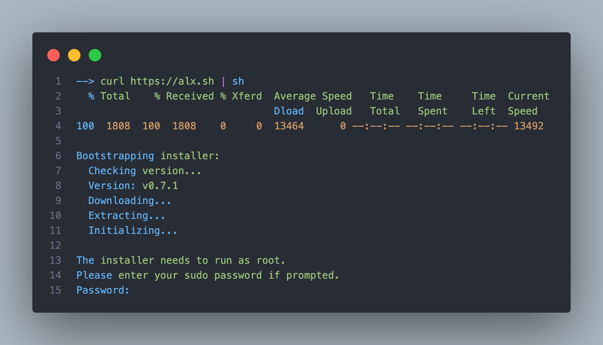
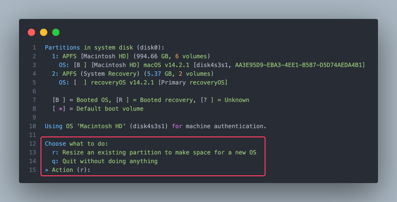
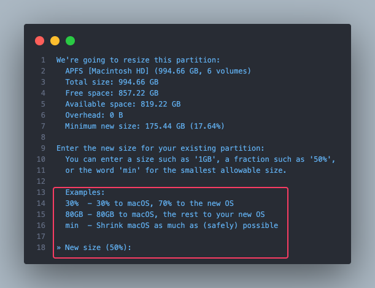
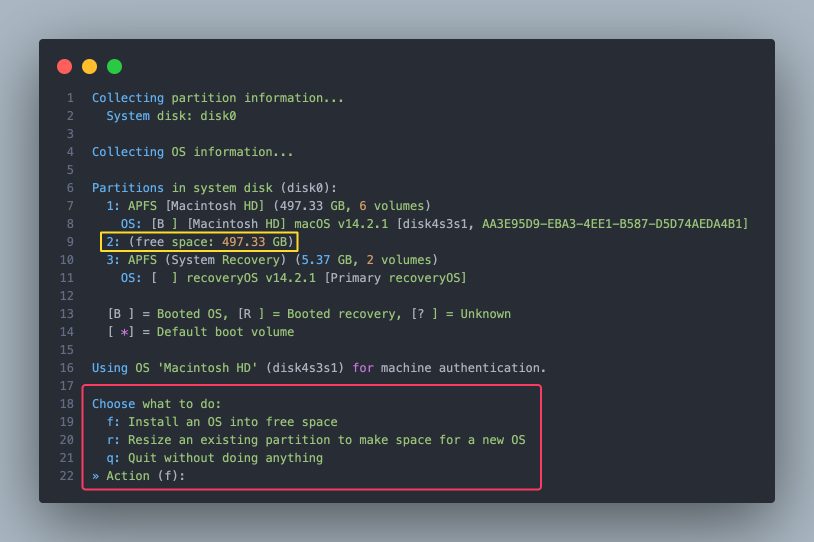
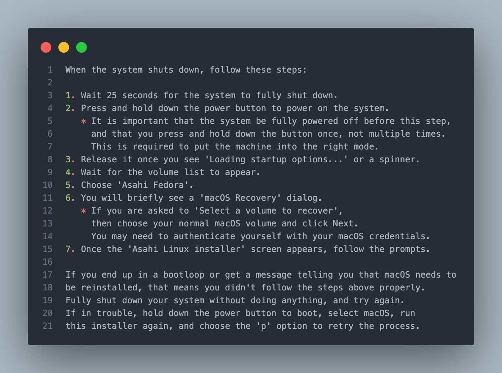

This guide is a comprehensive companion in installing Asahi Linux on your
compatible Apple Silicon Mac.
Whether you're a seasoned Linux enthusiast or new to the world of open-source
operating systems, this step-by-step instructions are crafted to ensure a
smooth, understandable, and successful installation experience.

::::danger Important Notice

## Features limitations

As you embark on the journey of installing and exploring Asahi Linux on your
Apple Silicon Mac, we want to ensure that you are **fully informed** about the
current state of hardware and software support.

While Asahi Linux represents a significant leap forward in running Linux on
Apple Silicon, it's important to be aware of certain features and
functionalities that are not yet supported or are in the early stages of
development.

Unsupported Features You Should Know About :
- **Hardware-Specific Features:** Certain Apple-specific hardware features, such
as the Touch Bar on some MacBook models, might not be functional.

- **Power Management:** While significant progress has been made, power
management features may not be entirely on par with macOS, potentially affecting battery life and thermal performance.

- **Wireless Connectivity:** Wi-Fi and Bluetooth functionalities might have
limited support, depending on your specific Mac model.

:::caution
We recommend that users who rely heavily on these features for their
day-to-day activities consider the current supported
[features](https://github.com/AsahiLinux/docs/wiki/Feature-Support) and
current broken [software](https://github.com/AsahiLinux/docs/wiki/Broken-Software)
before installing Asahi Linux.
:::

## Requirements
- Apple Silicon chipset like M1, M2 or M3 family (you can find all supported devices
[here](https://github.com/AsahiLinux/docs/wiki/Devices))
- macOS Sonoma 12.3 or later
- Administrator privileges
- At least 60GB of free disk space (Asahi Linux Desktop require around 15Go)
- A fairly good internet connection (between 700Mo and 4Go of download)

:::info
You don't need a USB stick because unlike most of OS installation, Asahi Linux doesn't require any ISO file. 
:::

:::caution
Do not forget to backup your disk for precaution before installing Asahi Linux
even though the installer will not erase your macOS partition. You can never be too cautious!
:::

## Installation
The installation of Asahi Linux is quite straight forward, so don't worry
everything will be easy!

- First copy/paste [this](https://asahilinux.org/) command into your terminal
```bash
curl https://alx.sh | sh
```
- Enter your sudo password :



- Press enter to skip the welcome message
- Some OS information is displayed on your screen. After this, type 'r' to resize an existing
partition to make space for a new OS



- Now choose the partition size you want to leave for macOS :


:::caution
Choose your partition size wisely, it **can't** be changed after that step.
:::

- Press 'y' after the system freezing note (it's normal don't worry)
- Wait for the partitioning process to end
- Press 'enter' after partitioning is done
- Press 'f' to install Asahi Linux into the newly allocated free space


:::info
If you can see the newly allocated space (yellow), then the partitioning
process
occurred without error.
:::

- Choose the OS you want to install by pressing the corresponding key
- Press 'enter' in order to use all available free space for Asahi Linux
- Enter a name for your newly created OS

:::tip
Enter a name you can remember or obvious like Asahi Fedora
:::

- Now the OS will be installed, wait for it to end
- Enter macOS sudo password
- If you want to improve Asahi Linux, press 'y' to report your install, if
not then press 'n'
- Press enter to reboot

:::danger
We will enter the only "complex" part, so know please strictly follow the
instructions if you don't want to leave your new installation in an unbootable state
:::

- Here are the following instructions :


:::note
If you wat this part to be detailed, please open an issue [here](https://github.com/EpiMac/docs/issues)
:::

- After booting into Asahi Fedora, follow the installing process like a
normal Linux OS installation

:::tip
Don't forget to update your system when first using it 😉
```bash
sudo pacman -Syyu
```
:::

- **Good Job ! You're now a member of Asahi Linux Community !**

## Uninstall
In order to uninstall Asahi Linux, you simply need to :
- Run this command :
```bash
curl -L https://alx.sh/wipe-linux | sh
```
:::note
If you got an error about sudo privilege, nothing to worry about
:::

- Go to disk utility and erase free partition
**You erased Asahi Linux successfully!**