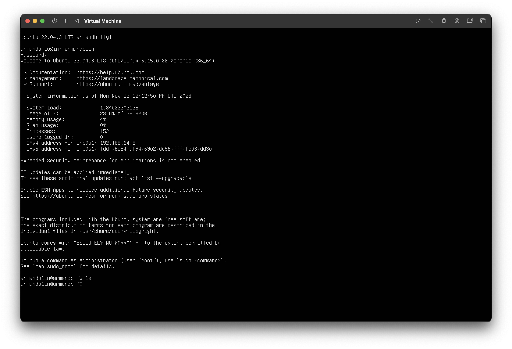
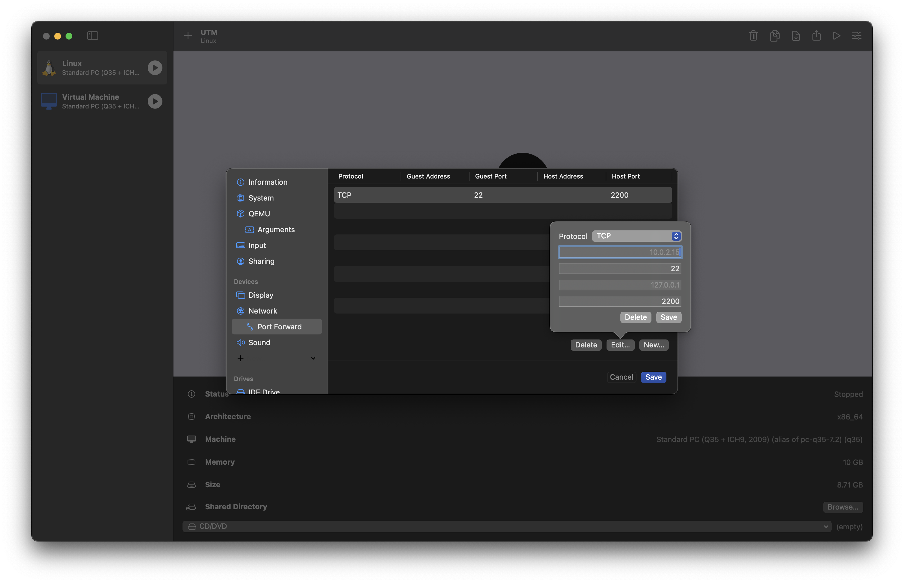

import Settings from "./img/doc_X86_Settings.png";
import Menu from "./img/doc_X86_Menu.png";

This tutorial will show you how to create a virtual machine on your Mac Silicon, and how to connect to it with VS Code. After completing the tutorial, you will be able to compile your code with a x86_64 architecture on your Mac.

## Prerequisites

- A Silicon Mac (M1/M2/M3)
- A minimum of 64 GB free disk space

## Download UTM

UTM lets you virtualize and emulate any architecture on a Silicon Mac.

Download the latest UTM version:
[Download here](https://github.com/utmapp/UTM/releases/)

Note that there is a paid version of UTM on the App Store, identical to the one above except for automatic application updates.

## Download a linux distribution for our VM

For this tutorial, we'll be using an Ubuntu Server image, on x86_64 architecture which is similar to the one used on EPITA computers. You can find the ISO image [here](https://ubuntu.com/download/server).

:::note

You can choose the distribution you want, as long as you take a x86_64 architecture

:::

## Creating an emulated virtual machine

On UTM, click on the `Create a new Virtual Machine` button. Then `Emulate`, then `Other`.

You can then add (by clicking on `Browse`) your path to the ISO image you've just downloaded.

Click on `Continue`.

## Setting up the virtual machine

- Check that you have selected `x86_64` in the `Architecture` drop-down list.

- Leave `System` as the default.

- You can then choose the amount of RAM you wish to allocate to your virtual machine. 6144 MB and 6 cores is recommended.

  

- You can then specify the size allocated for your virtual machine. Select 64GB.

- You can ignore the Shared Directory section.

- On the summary, you can name the VM as you wish.

## Virtual machine installation

- Launch your virtual machine.

### Basic VM configuration

*You should see a window open.*

:::tip

Use the TAB, Space and Enter keys to navigate the menu

:::

- Take the first choice from the list.

*Your VM should install with check **`[ OK ]`** on the left*.

*You should then see a window with different languages*.

- Choose a language.

- Then, if an update is available, you can install it if you wish.

- Next, select the right layout for your keyboard.

- You'll be able to select the type of installation. Choose the first option `Ubuntu Server`.

- You're now on the Network interface. Your network should be automatically selected. You can proceed.

- Select next on the `Proxy` tab.

*You are now on `Ubuntu Archive Mirror`. Wait for it to detect the archives*.

- If you get no error, do next.

### Advanced VM configuration

- Then you can choose the VM partitions. Do `Use entire disk`. You should see `local disk 64GB`.

*You can encrypt your disk if you wish.*

- Do next and `Continue` on the `Storage Configuration` tab.

- You can now add your VM information.

  

- Click on next for the `Ubuntu Pro` tab.

*You're now on the `SSH Setup` tab*.

- Press space to check `SSH server` installation.

*You are now on the `Featured Server Snaps`* tab.

- Click next.

*You should see a window with `Installing the system`.*

:::info
The installation process is a bit slow...
:::

- You can then click on `Reboot Now`.

- When you see the error message `Unable to unmount`, stop your VM. Then go to the UTM interface and click on CD/DVD. Then click on `Clear`.

- You can restart your VM and connect to your new VM.

## Connect VS Code to your VM

- Add an SSH key to your VM.

- Stop your VM.

- On UTM, click on `Edit` then `Network`.

- Change the `Network Mode` field to `Emulated VLAN`.

- You'll see `Port Forward` in the navigation bar. Click on it.

- Enter the following information:

- Install the `Remote Explorer` extension on VS Code: [Click here](https://marketplace.visualstudio.com/items?itemName=ms-vscode.remote-explorer)

- You'll see `Remote Explorer` in the navigation bar. Click on it.

- Add a new SSH connection with field `ssh <username>@127.0.0.1 -p 2200`. Replace `<username>` with the `server's name` field entered in the menu (<a href="#menu">here</a>).

- You'll need to enter your password to connect to your VM.

- You now have access to your VM's terminal from VS Code and can compile your projects with an x86_64 architecture!

## Sources
- [Article on VS Code SSH Remote](https://medium.com/@lizrice/linux-vms-on-an-m1-based-mac-with-vscode-and-utm-d73e7cb06133)

For any question you can contact me on Discord: `armandb`.
